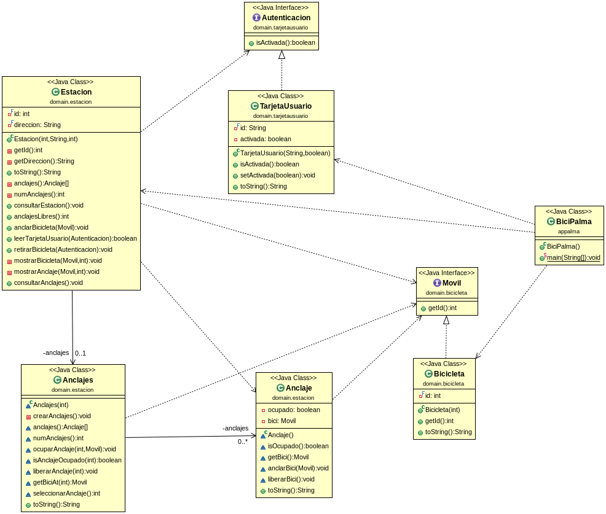

# Bicipalma

Este ejercicio ha sido proporcionado por el usuario [@dfleta](https://github.com/dfleta). La informacion del ejercicio la encontrareis en el siguiente [link](https://github.com/dfleta/bicipalma).

Este diagrama ha sido proporcionado por el usuario [@dfleta](https://github.com/dfleta).

Se trata de realizar una aplicacion de funcionamiento de las bicicletas publicas de Palma de Mallorca. 

